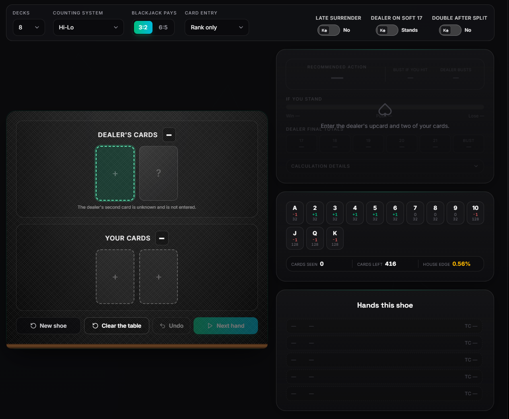

# BJack.io — Blackjack Calculator & Basic Strategy Chart

**BJack.io** is a **blackjack calculator and basic strategy chart** for **expected value (EV), blackjack odds, card counting and real-time shoe tracking**.

Unlike a static blackjack strategy chart, BJack calculates decisions using the **actual cards remaining in the shoe**. Enter cards as they appear, and the calculator updates the shoe composition, probabilities, count and expected value. [**Visit BJack.io**](https://bjack.io/)

  

## Features

### Blackjack EV & Strategy Calculator

Calculate the **expected value (EV)** of every available blackjack action — **Hit, Stand, Double, Split and Surrender**. BJack compares each option using the current hand, table rules and remaining shoe composition.

### Real Shoe Tracking

Track cards as they are dealt and calculate probabilities from the **actual remaining shoe**. Cards can be entered using **All 52**, **Rank → Suit**, or **Rank Only** modes, depending on the level of detail required.

### 1–8 Decks

Configure **1, 2, 4, 6 or 8 decks**. The selected number of decks affects remaining-card probabilities, true count, EV and strategy calculations.

### Card Counting Systems

BJack supports **six blackjack card counting systems**: **Hi-Lo, KO (Knock-Out), Zen Count, Omega II, Wong Halves and Red 7**. The calculator tracks the **running count** and, where applicable, calculates the **true count** based on the decks remaining.

### Basic Strategy & Deviations

Generate **blackjack basic strategy** based on the selected table rules and current shoe composition. Supported rules include **H17 / S17, Double, Double After Split (DAS), Surrender, Resplitting, Split Aces, 3:2 / 6:5 blackjack payouts and 1–8 decks**.

### Blackjack Odds & Probabilities

Calculate **dealer and player probabilities**, including dealer **17–21 and bust**, player bust probability, **win / push / loss probabilities, insurance EV** and the expected value of available actions.

Open the [**Blackjack Calculator**](https://bjack.io/)

## Blackjack Basic Strategy Chart

The BJack.io [**Basic Strategy Chart**](https://bjack.io/blackjack-basic-strategy-chart) generates the recommended **Hit, Stand, Double and Split** decisions for your selected game configuration.

Choose the **number of decks and table rules**, including **H17 / S17, Double After Split (DAS), Surrender, Resplitting and blackjack payouts**. The chart supports **1, 2, 4, 6 and 8 decks**.

BJack uses the same calculation engine for its strategy, EV and probability calculations, allowing the chart to work alongside the full blackjack calculator.

The chart is designed specifically for **blackjack players who want to learn and practice card counting mentally**. It provides a simple and focused way to study blackjack strategy, understand how different rules affect decisions, and practice making decisions without relying on a physical calculator at the table.

The tool is **completely free to use** and features a **clean, comfortable color scheme** designed to make the strategy chart easy to read and study for extended periods.
